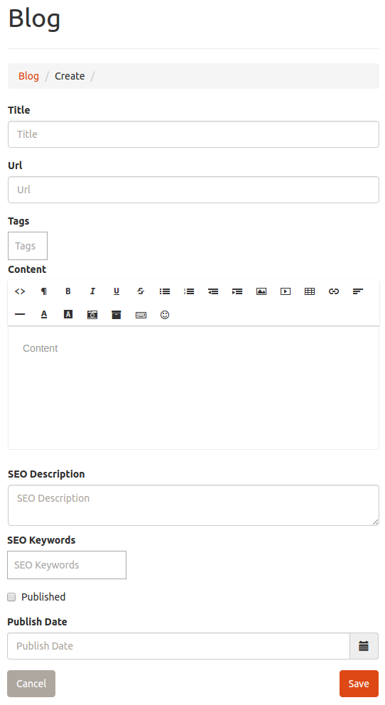


# Blog Editor

The blog editor is used to produce content within your website.  Producing unique content on a regular basis can help for search engine optimization (SEO) purposes.  In addition to providing generic content for your site, the blog editor is also used to provide content for specific sections within your websites home page by including specific tags on your blog post.

Clicking a create / edit button on blog post content from the front end of your website will direct you to this page within your dashboard.  You may also access this editor at any time from your dashboard by selecting "Blog" from the side menu of your administrators dashboard.

For more information on creating content for specific sections within your website see;

* [Populating Content with the Blog Editor](../home_page_content/#populating-content-with-the-blog-editor)
* [List of Special Tags](../home_page_content/#list-of-special-tags)

---

## Using the Blog Editor

* **Title** - The title is a name that describes the content you are creating.  When creating a testimonial, the title is used to give attribution for the testimonial.
* **Url** - The URL is must be unique amongst all of your blog post and is used to generate a unique route to access your post content.  It is initially generated off of the title automatically, but can be changed.
* **Tags** - Tags are traditionally used to group common posts together, and allows users of your site to browse content as categories.  You can enter as many tags as you see fit for categorizing the content.  Specify multiple tags by using a comma to separate them.  You should develop an organized pattern for the tags and try to re-use the same tags for much of the content create. **Note** - The tags are also what is used to appoint the content you create to be used within special reserved sections of your website.  See [List of Special Tags](../home_page_content/#list-of-special-tags) for specifics.
* **Content** - A WYSIWYG (**W**hat **Y**ou **S**ee **I**s **W**hat **Y**ou **G**et) editor is provided in order for you to create the actual content body for your blog posts.  A tool bar is provided to allow you to easily enhance the content with basic content formatting features.  **Note** - Some of the *"Click and Build"* sections of your home page provide special emphasis if the first element is an image or an icon.
* **SEO Description** - The SEO Description allows you to provide additional meta information for the search engines to optimize your content within their search results.
* **SEO Keywords** - The keywords allow you to provide suggested search terms to the search engines to optimeze your content within their search results.
* **Published** - Checking this box will ensure your content is visible on your site.  If you are not ready for your content to be visible to your users, uncheck this box and it will not be visible to your users or search engines.  This is useful if you want to save content, but do not want it to be visible yet as you are still editing it.
* **Publish Date** - This is typically used to delay the publishing of your content.  This is a valuable strategy in creating a lot of content at one sitting, and ensuring it publishes at different intervals in the future to give the appearance of fresh active content released at a consistent timeframe.  You may also pre date the content to make it appear immediately.