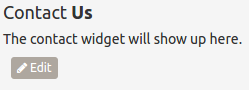

# Contact Us Widget

A section within the footer of your website is reserved for contact information that visitors of your website can use to contact you.  

You can create / edit this contact information just like the other sections on your website.  The content for the contact us section is provided by a "widget" as opposed to a blog post as with the other sections of your website.  An editor within the GetRealT section of your dashboard has been provided to help you easily create a default contact widget.

