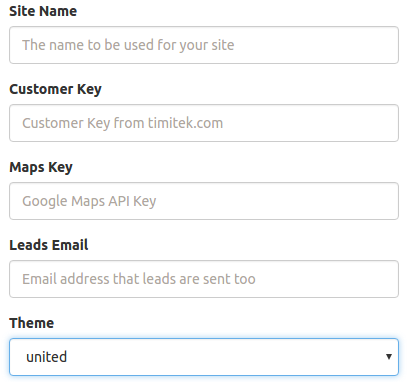


# GetRealT Settings

From the GetRealT settings page, you can specify customizations and additional settings necessary for your site to work correctly as a real estate web portal.

**Site Name** - This is the main identifier for your site.  This will be used in e-mails that go out, and displayed in the heading of your home page.

**Customer Key** - This is the customer key assigned to you from timitek that is used to provide the listing feeds to your site.  You can obtain your key at [http://www.timitek.com](http://www.timitek.com "").

**Maps Key** - This the google maps API key that is necessary for displaying maps and directions on your listing details page.  You can obtain your google maps API key at [https://developers.google.com/maps/documentation/javascript/get-api-key](https://developers.google.com/maps/documentation/javascript/get-api-key "").

**Leads Email** - This is the email address that any leads which are captured will be sent too.

**Header Image Tag** - This allows you to override the random images that appear at the top of your website pages, with images from your gallery.  The list of tags which are presented are tags assigned to images from your gallery.

**Theme** - This is the the theme that defines the look and feel of your website.
