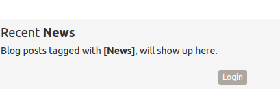
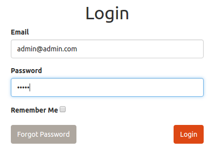
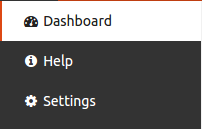
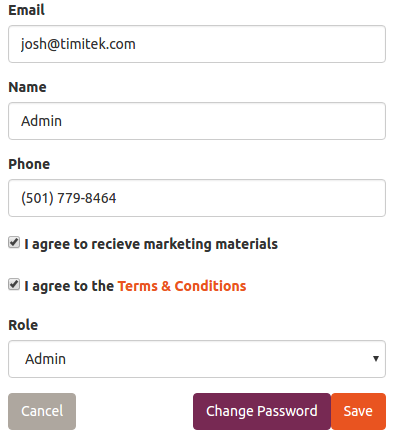
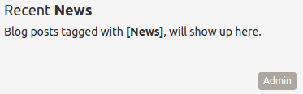
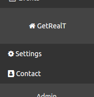
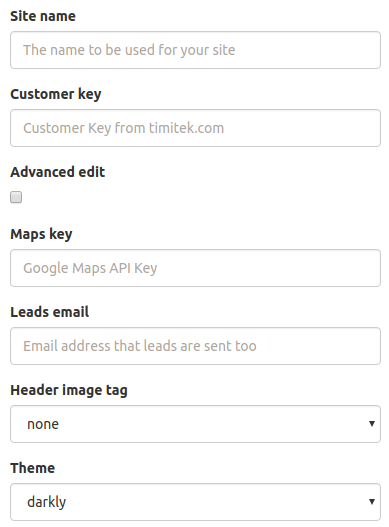

# Post Installation Setup

## Setting Admin Password

After installing there are some steps you must perform in order to finish configuring your site for use.  Your site has a default landing page that will allow you to *click and build* some initial content.  However, you must first log into your Quarx admin dashboard.  

### Login to the Quarx dashboard

Follow the *Login* link at the bottom of your home page to authenticate yourself as an administrator, to enable the *click and build* features.  



The default passwordfrom the login page the default user name and password is;

**Email** ```admin@admin.com```

**Password** ```admin```



### Change Your Password

After logging in to the admin dashboard for the first time, you should change your admin username and password from the settings menu.



Make sure specify your e-mail, and after clicking **Save**, click the **Change Password** button. Remember that the default *Old Password* is ```admin```.



### Admin Link

Now that you have been logged in as the administrator, you can always return to the dashboard by clicking the *Admin* button at the bottom of the website.



## Setting up GetRealT

The next step is to make sure your GetRealT settings are correct and set up the contact information.  All of this may be done from the admin dashboard via the GetRealT menu.



### GetRealT Settings

From the GetRealT settings page, you can specify customizations and additional settings necessary for your site to work correctly as a real estate web portal.




**Site Name** - This is the main identifier for your site.  This will be used in e-mails that go out, and displayed in the heading of your home page.

**Customer Key** - This is the customer key assigned to you from timitek that is used to provide the listing feeds to your site.  You can obtain your key at [http://www.timitek.com](http://www.timitek.com "").

**Maps Key** - This the google maps API key that is necessary for displaying maps and directions on your listing details page.  You can obtain your google maps API key at [https://developers.google.com/maps/documentation/javascript/get-api-key](https://developers.google.com/maps/documentation/javascript/get-api-key "").

**Leads Email** - This is the email address that any leads which are captured will be sent too.

**Theme** - This is the the theme that defines the look and feel of your website.
